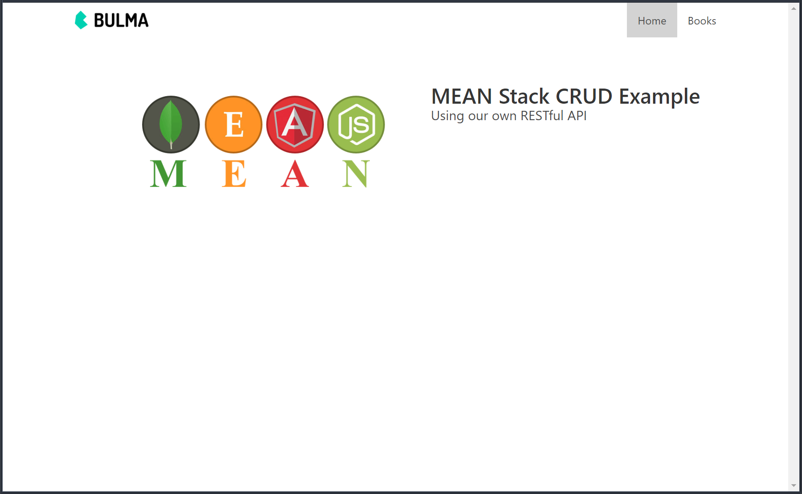

# MEAN CRUD Example
This program is an example of a CRUD application using the MEAN stack.  This project was modified from the original code provided in this article: [MEAN Stack (Angular 5) CRUD Web Application Example](https://www.djamware.com/post/5a0673c880aca7739224ee21/mean-stack-angular-5-crud-web-application-example) by *Didin J.*  The GitHub repo for his project can be found [here](https://github.com/didinj/mean-stack-angular5-crud).

     
    <a href="https://fast-crag-63853.herokuapp.com/" target="_blank">MEAN Stack CRUD Example</a>

## Versions
* MongoDB v3.6.0 (Mongoose v4.13.8)
* Express v4.16.2
* Angular v5.1.2
* Node.js v9.3.0

## Installation
1. Clone this repo
1. `cd` into the folder of the cloned repo
1. Run `yarn install` to install dependencies
1. Start your local MongoDB instance
1. Choose to run the development or production server
    * Development
        * Front End (Angular)
            * Run `ng serve`, and navigate to `http://localhost:4200/`. 
        * Back End (MongoDB, Express, Node.js)
            * Run `yarn run dev`, and navigate to `http://localhost:3000/`.
    * Production
        * Run `yarn start`, and navigate to `http://localhost:3000/`.

## Built-in scripts
* `yarn run dev`
    * Builds the Angular project without build optimization into the `dist/` folder
    * Runs the `server.js` node app
* `yarn start`
    * Builds the Angular project into the `dist/` folder
    * Runs the `server.js` node app

## Installed Packages
### Front-end
* Angular 5
* [Bulma CSS Framework](https://bulma.io/)
* [Font-Awesome 5](https://fontawesome.com/)

### Back-end
* Express
* Mongoose
* Body-Parser

### Development
* Angular CLI v1.6.3
* Morgan Logging library
* Typescript
